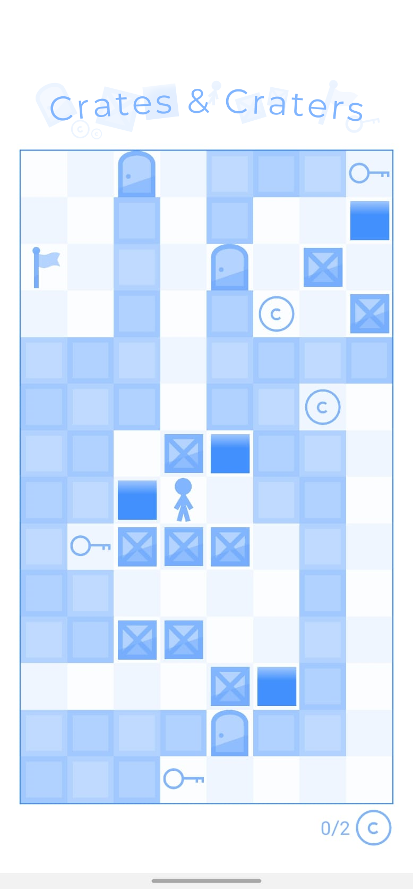
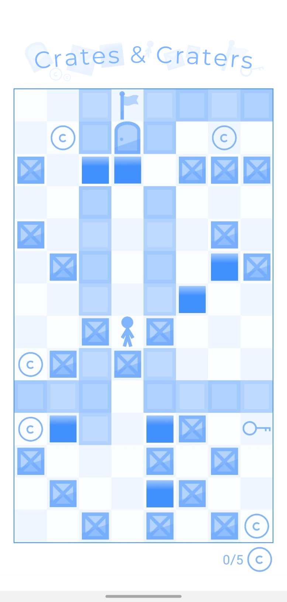
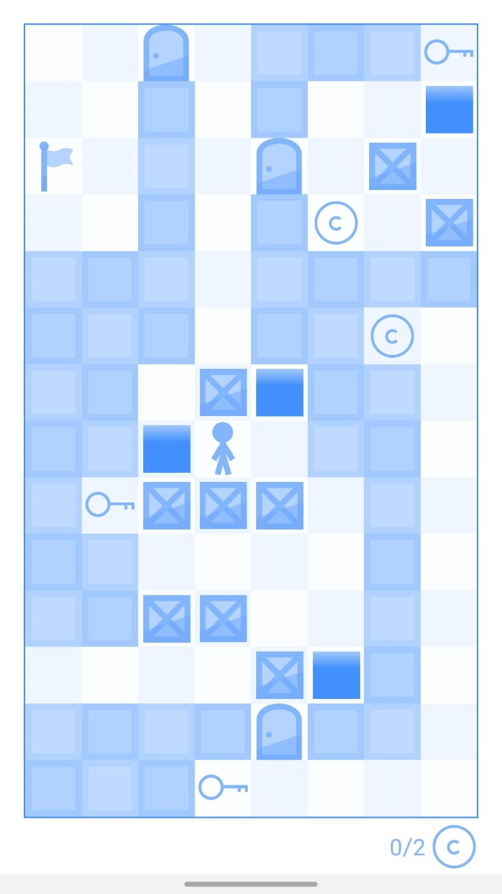
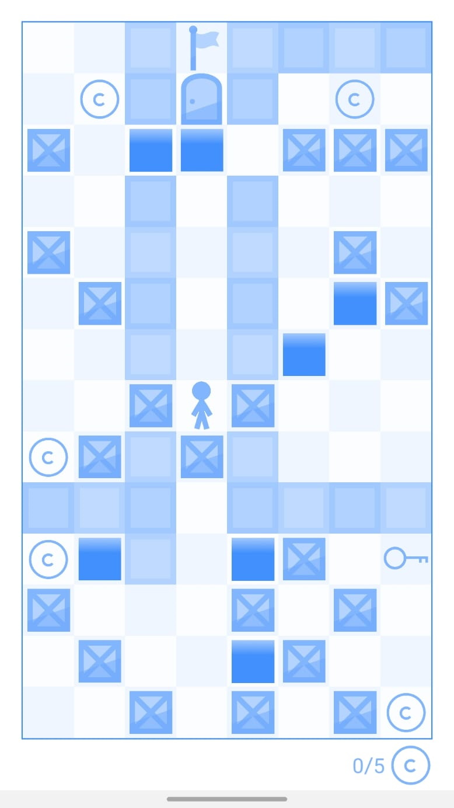

## About
Built with JavaScript and React Native, Crates and Craters is a single player puzzle game built for iOS and Android. Don't let the simple premise and minimalist graphics decieve you thought, the game gets challenging, fast!

## How to Play
The objective of the game is to collect all of the coins and reach the flag. The map is a grid of square tiles, where the player can move vertically and horizontally one tile per turn. The player can walk on any empty floor tile or tiles occupied by coins or keys to collect those items.

Demo | Explanation
:-------------------------:|:-------------------------:
  |  
There are a number of obstacles in the players way. The first are walls, which cannot be walked through or interacted with in any way. The edges of the map are also walls.  The second obstacle are doors, which function the same as a wall unless opened with a key. Any key can open any door, but is used up in the process and the door cannot be re-locked to retrieve the key. Once a door tile is opened with a key, it is just like an empty floor tile.

 | 
Finally the last two obstacles are crates and craters. The player cannot walk on either type of tile, however, if there is an empty tile or a crater behind a crate, the player can <b>push</b> the crate by walking into it. If the tile behind is an empty tile, this simply moves the crate. Keep in mind that the player needs to be able to get behind the crate to push it!    If the tile the crate is pushed into is a crater, the crate will fall in and <b>fill in</b> the crater, creating a normal, walkable floor space. Crates cannot be pushed onto coins, keys, or into doors or the flag.    These are all of the basic rules of Crates & Craters. There is a <b>how to play</b> page in the app, or you can hop on in and try the tutorial levels to get started!
 

<!-- 

  
  

    There are a number of obstacles in the players way. The first are walls, which cannot be walked through or interacted with in any way. The edges of the map are also walls.
      
    The second obstacle are doors, which function the same as a wall unless opened with a key. Any key can open any door, but is used up in the process and the door cannot be re-locked to retrieve the key. Once a door tile is opened with a key, it is just like an empty floor tile.
  

 -->

<!-- 

  

    Finally the last two obstacles are crates and craters. The player cannot walk on either type of tile, however, if there is an empty tile or a crater behind a crate, the player can <b>push</b> the crate by walking into it. If the tile behind is an empty tile, this simply moves the crate. Keep in mind that the player needs to be able to get behind the crate to push it!
      
    If the tile the crate is pushed into is a crater, the crate will fall in and <b>fill in</b> the crater, creating a normal, walkable floor space. Crates cannot be pushed onto coins, keys, or into doors or the flag.
      
    These are all of the basic rules of Crates & Craters. There is a <b>how to play</b> page in the app, or you can hop on in and try the tutorial levels to get started!
  

  

 -->

### Running Locally

Running and testing the app locally will require that you possess a phone with Expo Go installed on it and a working internet connection. Open the root folder and type `expo start`. For some reason, tunnel is the only connection type that works, so open the dev tools and switch to that mode.

### Building to APK

Make sure you are logged in to expo with `expo whoami`. If not logged in, run `expo login`.
Then use this command to build to apk:  
`eas build -p android --profile preview`

### TODO
* Add more sound variations
* Add option to turn off sounds
* Finish creating local saving funcitonality
* Make more levels
* Create a proper tutorial?
* Look into ways to level share (perhaps QR codes until a server can be set up?)
* Proper settings screen (move dark mode and app theme there, then add sensitivity slider there)