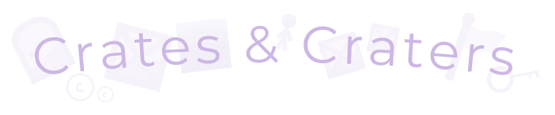
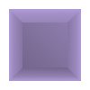
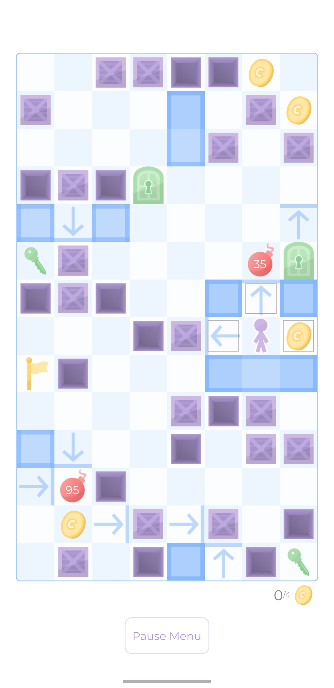
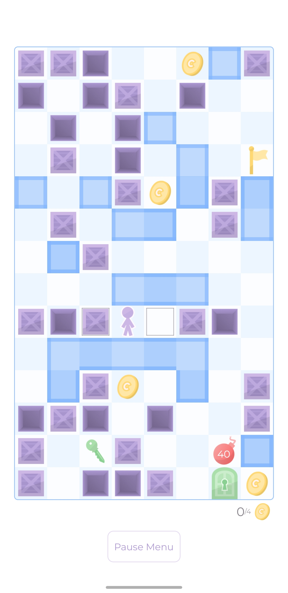
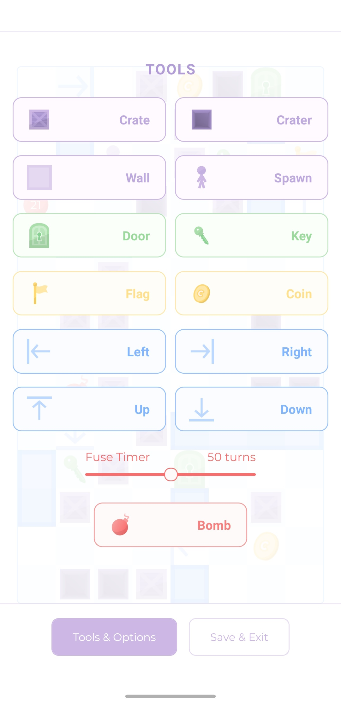
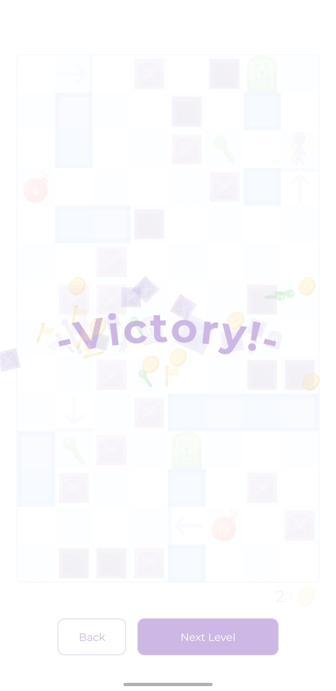

<!--  -->

<h2 style="display: flex; align-items: center;">
  About
  
  
</h2>

Built with JavaScript and React Native, Crates and Craters is a single player puzzle game built for iOS and Android. Don't let the simple premise and minimalist graphics decieve you, the simple mechanics compound to create challenging and layered gameplay!

<h2 style="display: flex; align-items: center;">
  Features
  
  
</h2>

* Dozens of puzzling levels
* A built in level editor and level sharing
* Minimalist game design and graphics
* Small app size
* Light and dark modes
* And lots more to come!

 

<table>
  <tr>
    <td>
      <picture>
        <source 
          srcset="misc/screenshot_1_dark.png"
          media="(prefers-color-scheme: dark)"
        />
        <source
          srcset="misc/screenshot_1.png"
          media="(prefers-color-scheme: light), (prefers-color-scheme: no-preference)"
        />
        
      </picture>
    </td>
    <td style="padding-left: 10%;">
      <!-- <h2 style="display: flex; align-items: center;">
        How To Play
        
      </h2> -->
      

        The objective of the game is to collect all of the coins and reach the flag. The map is a grid of square tiles, where the player can move vertically and horizontally one tile at a time. The player can walk on any empty floor tile or tiles occupied by coins or keys to collect those items.
          
        There are a number of obstacles in the players way. The first are walls, which cannot be walked through or interacted with in any way. The player cannot walk off the edges of the map either.
          
        The second obstacle are doors, which function the same as a wall unless opened with a key. Any key can open any door, but is used up in the process and the door cannot be re-locked to retrieve the key. Once a door tile is opened with a key, it is just like an empty floor tile. To open a door once you have collected a key, move onto the door tile.
      

    </td>
  </tr>
</table>

<table>
  <tr>
    <td style="padding-right: 10%;">
      

        The primary obstacles and namesakes of the game are crates and craters. The player cannot walk on either type of tile, however, if there is an empty tile or a crater behind a crate, the player can <b>push</b> the crate by walking into it. If the tile behind is an empty tile, this simply moves the crate to that tile. Keep in mind that the player needs to be able to get behind the crate to push it!
          
        If the tile the crate is pushed into is a crater, the crate will fall in and <b>fill in</b> the crater, creating a normal, walkable floor space. Crates cannot be pushed onto coins, keys, or into doors or the flag.
          
        Another tile which has interactions with crates are bombs. Bombs display a number representing their fuse. After that number of turns, the bomb will detonate, destorying adjacent crates. Bombs, like crates, can be pushed.
      

    </td>
    <td>
      <picture>
        <source 
          srcset="misc/screenshot_4_dark.png"
          media="(prefers-color-scheme: dark)"
        />
        <source
          srcset="misc/screenshot_4.png"
          media="(prefers-color-scheme: light), (prefers-color-scheme: no-preference)"
        />
        
      </picture>
    </td>
  </tr>
</table>

<table>
  <tr>
    <td>
      <picture>
        <source 
          srcset="misc/screenshot_5_dark.png"
          media="(prefers-color-scheme: dark)"
        />
        <source
          srcset="misc/screenshot_5.png"
          media="(prefers-color-scheme: light), (prefers-color-scheme: no-preference)"
        />
        
      </picture>
    </td>
    <td style="padding-left: 10%;">
      

        The final tile type are one ways. These tiles are fairly simple, the player can move onto them from any direction, except the direction in which the arrow is pointing. Also, pushables like bombs and crates cannot pass through one ways (in any direction).
          
        In order to successfully complete a level, the player must be able to reach the flag and stand on that tile after having collected all the coins. Not every key need be collected, nor every door opened. Beware of decoy keys, especially if a level contains less doors than keys!
          
        These are all of the basic rules of Crates & Craters. There is a <b>how to play</b> page in the app in case you forget, or you can hop on in and try the tutorial levels to get started!
      

    </td>
  </tr>
</table>

<table>
  <tr>
    <td style="padding-right: 10%;">
      <h2 style="display: flex; align-items: center;">
        Running Locally
        
        
      </h2>
      

        Running and testing the app locally will require that you possess a phone with Expo Go installed on it and a working internet connection. To work with live refresh, run: 
        <b>expo start</b> 
        Since the game is fairly computationally intensive for React Native, to see production accurate performance run: 
        <b>npx expo start --no-dev --minify</b>
      

       
      <h2 style="display: flex; align-items: center;">
        Building APK
        
        
      </h2>
      

        Make sure you are logged in to expo with <b>expo whoami</b>. If not logged in, run <b>expo login</b>.
        Then use this command to build to apk for android:  
        <b>eas build -p android --profile preview</b> 
        Or to build app bundle for production:  
        <b>eas build -p android</b>
      

    </td>
    <td>
      <picture>
        <source 
          srcset="misc/screenshot_6_dark.png"
          media="(prefers-color-scheme: dark)"
        />
        <source
          srcset="misc/screenshot_6.png"
          media="(prefers-color-scheme: light), (prefers-color-scheme: no-preference)"
        />
        
      </picture>
    </td>
  </tr>
</table>

 

<h2 style="display: flex; align-items: center;">
  TODO
  
</h2>

Higher priority:

* Improve VirtualizedList performance especially as content length increases
* Improve firestore security rules, rely less on frontend logic
* Add option to redownload shared levels which are no longer on device

Lower priority:

* Back action should be more useful, actually returning to previous screen
* Refactor play and edit screen pause menu container into separate component
  * Menu should close when the user presses on it (not on a button)
* Design and add many, many more levels, perhaps with new tile types
  * Review level 16, might be too easy for where it is
* Do benchmarking to determine if the use of useCallback in App.tsx is worthwhile
* Could [react native web assembly](https://github.com/cawfree/react-native-webassembly) help improve performance?

Potential tasks:

* Upgrade oneways from being single direction to being any combination of all four directions
  * Add variants which filter different things (just pushables or just the player) if there is a good way to graphically indicate what is filtered
* Consider making bombs destroy keys and coins?
* Make notifications persist using MMKV?
* Add enemy tile and associated logic
* Snow / glue tiles?

<h2 style="display: flex; align-items: center;">
  Known Bugs
  
</h2>

* Sometimes the move preview squares animation just stops
  * Was reproducibly happening due to id issues, fixed that bug, now is less frequent
  * Occured when going from level to next level (fixed)
  * See Player.tsx
* Long level names may overflow card title
  * See ManageLevel.tsx
* There are sometimes tiny 1px gaps between board tiles that vary by screen dimensions
  * Not due to rounding, tile sizes are whole numbers
  * See GameBoard.tsx
* Board rows have gaps between them (sometimes?)
  * Depends on screen size, but also sometimes it just doesn't happen making it difficult to reproduce
  * There may also be a gap between the rows and the border, see application on Pixel 2